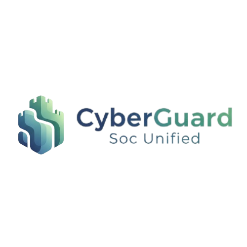

<div align="center">
  
  
  # CyberGuard Unified SOC
  
  **🚀 Plateforme de Sécurité Unifiée - Security Operations Center**
  
  [](https://docker.com)
  [](https://reactjs.org)
  [](https://fastapi.tiangolo.com)
  [](https://python.org)
  
  
  
  
  
</div>

---

## 🔒 Description
CyberGuard Unified SOC est une plateforme de sécurité unifiée qui intègre plusieurs outils de cybersécurité open source pour fournir une vue d'ensemble complète de la sécurité de votre infrastructure.

## 🏗️ Architecture
La plateforme intègre les outils suivants dans une architecture containerisée :

### **🖥️ Core Services**
- **Frontend** : Interface utilisateur React (port 3000)
- **Backend** : API FastAPI Python (port 8000)

### **🛡️ Security Tools**
- **Wazuh** : SIEM & détection d'intrusion (port 55000)
- **Graylog** : Gestion et analyse des logs (port 9000)
- **TheHive** : Gestion des incidents (port 9001)
- **MISP** : Threat Intelligence Platform (port 443)
- **OpenCTI** : Cyber Threat Intelligence (port 8080)
- **Velociraptor** : Digital forensics (port 8889)
- **Shuffle** : SOAR - Orchestration (port 3443)

### **💾 Infrastructure**
- **MongoDB** : Base de données principale (port 27017)
- **Elasticsearch** : Moteur de recherche (port 9200)
- **Redis** : Cache et sessions (port 6379)
- **MySQL** : Base de données MISP (port 3306)

---

## 🖥️ Prérequis

### **Configuration Matérielle**
| Composant | Minimum | Recommandé |
|-----------|---------|------------|
| **CPU** | 8 cœurs | 16+ cœurs |
| **RAM** | 16 GB | 32+ GB |
| **Stockage** | 100 GB | 500+ GB SSD |
| **Réseau** | 1 Gbps | 10+ Gbps |

### **Systèmes Supportés**

#### **🪟 Windows**
- Windows 10/11 (64-bit)
- Windows Server 2019/2022
- Docker Desktop pour Windows
- PowerShell 5.1+

#### **🐧 Linux**
- Ubuntu 20.04+ LTS
- Debian 11+
- CentOS/RHEL 8+
- Rocky Linux 8+
- Docker Engine 24.x+

### **Logiciels Requis**
- **Docker** : 24.x ou supérieur
- **Docker Compose** : 2.x ou supérieur
- **Git** : Version récente

## 🚀 Installation

### **🪟 Installation Windows**

#### **1. Prérequis**
```powershell
# Vérifier Docker
docker --version
docker-compose --version

# Vérifier PowerShell
$PSVersionTable.PSVersion
```

#### **2. Déploiement Automatisé**
```powershell
# Cloner le projet
git clone https://github.com/votre-org/cyberguard-unified-soc.git
cd "CyberGuard Unified SOC"

# Déploiement complet
powershell -ExecutionPolicy Bypass -File scripts\deploy.ps1
```

#### **3. Validation**
```powershell
# Vérifier l'installation
powershell -ExecutionPolicy Bypass -File scripts\validate.ps1
```

### **🐧 Installation Linux**

#### **1. Installation Automatisée**
```bash
# Cloner le projet
git clone https://github.com/votre-org/cyberguard-unified-soc.git
cd cyberguard-unified-soc

# Rendre les scripts exécutables
chmod +x scripts/*.sh

# Installation complète
sudo ./scripts/install.sh
```

#### **2. Validation**
```bash
# Vérifier l'installation
./scripts/health-check.sh

# Diagnostic complet
./scripts/diagnostic.sh
```

### **🛠️ Installation Manuelle (Multi-plateforme)**

#### **1. Configuration Docker**
```bash
# Linux
sudo systemctl start docker
sudo systemctl enable docker
sudo usermod -aG docker $USER

# Windows (Docker Desktop doit être démarré)
```

#### **2. Variables d'environnement**
```bash
# Vérifier/éditer le fichier .env
cp .env.example .env
nano .env  # Linux
notepad .env  # Windows
```

#### **3. Déploiement par étapes**
```bash
cd docker

# Étape 1: Bases de données
docker compose up -d mongodb elasticsearch redis misp-db

# Étape 2: Services principaux (attendre 60s)
docker compose up -d backend frontend

# Étape 3: Outils de sécurité
docker compose up -d wazuh-manager graylog thehive misp opencti velociraptor shuffle
```

## 🌐 Accès aux Services

| Service | URL | Utilisateur | Mot de passe |
|---------|-----|-------------|--------------|
| **🎯 Frontend Principal** | http://localhost:3000 | - | - |
| **🔧 Backend API** | http://localhost:8000/docs | - | - |
| **📊 Graylog** | http://localhost:9000 | admin | admin |
| **🎫 TheHive** | http://localhost:9001 | admin@thehive.local | secret |
| **🔍 MISP** | https://localhost:443 | admin@admin.test | admin |
| **🧠 OpenCTI** | http://localhost:8080 | admin@cyberguard.local | cyberguard_admin |
| **🔎 Velociraptor** | http://localhost:8889 | admin | cyberguard_velociraptor_password |
| **🤖 Shuffle** | https://localhost:3443 | admin | cyberguard_shuffle_secret |

## 🧹 Maintenance

### **🪟 Scripts Windows**
```powershell
# Nettoyage complet
powershell -ExecutionPolicy Bypass -File scripts\purge.ps1

# Nettoyage rapide
powershell -ExecutionPolicy Bypass -File scripts\quick-purge.ps1

# Validation système
powershell -ExecutionPolicy Bypass -File scripts\validate.ps1
```

### **🐧 Scripts Linux**
```bash
# Nettoyage complet
sudo ./scripts/purge.sh

# Nettoyage rapide
sudo ./scripts/quick-purge.sh

# Nettoyage sélectif (interactif)
sudo ./scripts/selective-purge.sh

# Diagnostic système
./scripts/diagnostic.sh

# Vérification santé
./scripts/health-check.sh
```

### **🔧 Commandes Docker Universelles**
```bash
# Voir l'état des services
docker compose ps

# Voir les logs
docker compose logs -f [service_name]

# Redémarrer un service
docker compose restart [service_name]

# Arrêter tous les services
docker compose down

# Démarrer tous les services
docker compose up -d

# Voir l'utilisation des ressources
docker stats
```

## 🔧 Dépannage

### **❌ Services qui ne démarrent pas**
```bash
# Multi-plateforme
docker compose ps
docker compose logs [service_name]
docker stats

# Nettoyer et redémarrer
docker compose down -v
docker system prune -f
docker compose up -d
```

### **💾 Problèmes de ressources**
```bash
# Vérifier l'espace disque
df -h          # Linux
Get-WmiObject -Class Win32_LogicalDisk  # Windows

# Vérifier la mémoire
free -h        # Linux
Get-WmiObject -Class Win32_ComputerSystem  # Windows

# Nettoyer Docker
docker system prune -af --volumes
```

### **🔄 Réinitialisation complète**

#### **Windows :**
```powershell
powershell -ExecutionPolicy Bypass -File scripts\purge.ps1
powershell -ExecutionPolicy Bypass -File scripts\deploy.ps1
```

#### **Linux :**
```bash
sudo ./scripts/purge.sh
sudo ./scripts/install.sh
```

---

## 📚 Documentation

- **📖 [Guide d'Installation Détaillé](docs/installation.md)**
- **⚙️ [Configuration Avancée](docs/configuration.md)**
- **👥 [Guide Utilisateur](docs/user-guide.md)**
- **🛠️ [Dépannage](docs/troubleshooting.md)**
- **🏗️ [Architecture](docs/architecture.md)**
- **🔒 [Sécurité](docs/security.md)**

## ⚠️ Sécurité

### **🔒 Actions Obligatoires pour la Production**
1. **Modifier TOUS les mots de passe par défaut**
2. **Configurer des certificats SSL valides**
3. **Configurer un firewall approprié**
4. **Activer l'authentification forte (2FA)**
5. **Mettre en place des sauvegardes automatiques**
6. **Durcir les configurations de sécurité**

### **🛡️ Variables d'environnement sensibles**
```bash
# Modifier dans le fichier .env
GRAYLOG_PASSWORD_SECRET=votre_secret_securise
GRAYLOG_ROOT_PASSWORD_SHA2=votre_hash_sha2
OPENCTI_TOKEN=votre_token_securise
# ... autres variables
```

## 🤝 Support

### **📞 Obtenir de l'aide**
1. **Documentation** : Consultez le dossier `docs/`
2. **Issues GitHub** : Créez une issue avec les logs
3. **Diagnostic** : Utilisez les scripts de diagnostic
4. **Community** : Forums et discussions

### **🐛 Signaler un problème**
```bash
# Générer un rapport de diagnostic
./scripts/diagnostic.sh  # Linux
# ou consultez les logs Docker
docker compose logs > system-logs.txt
```

## 📄 Licence

Ce projet est sous licence MIT. Voir le fichier [LICENSE](LICENSE) pour plus de détails.

---

**🔧 Version** : 2.0  
**📅 Dernière mise à jour** : Août 2025  
**🧪 Testé sur** : Windows 11, Ubuntu 22.04, Docker 24.x  
**👥 Équipe** : CyberGuard SOC Team

Chaque composant nécessite une configuration spécifique :

1. Wazuh :
   - Port : 55000
   - Configuration dans `docker/wazuh/config/ossec.conf`

2. Graylog :
   - Port : 9000
   - Configuration dans `docker/graylog/config/graylog.conf`

3. TheHive :
   - Port : 9001
   - Configuration dans `docker/thehive/config/application.conf`

4. MISP :
   - Port : 443
   - Configuration dans `docker/misp/config/config.php`

5. OpenCTI :
   - Port : 8080
   - Configuration dans `docker/opencti/config/production.json`

6. Velociraptor :
   - Port : 8889
   - Configuration dans `docker/velociraptor/config/server.config.yaml`

7. Shuffle :
   - Port : 3443
   - Configuration dans `docker/shuffle/config/shuffle-config.yaml`

## Utilisation

1. Accès à l'interface web :
   - URL : http://localhost:3000
   - Identifiants par défaut : admin/changeme

2. API Documentation :
   - Swagger UI : http://localhost:8000/docs
   - ReDoc : http://localhost:8000/redoc

3. Fonctionnalités principales :
   - Dashboard unifié
   - Gestion des alertes
   - Gestion des cas
   - Threat Intelligence
   - Automatisation des workflows
   - Corrélation d'événements
   - Reporting

## Développement

1. Configuration de l'environnement de développement :
```bash
# Backend
cd backend
python -m venv venv
source venv/bin/activate  # ou venv\Scripts\activate sous Windows
pip install -r requirements.txt

# Frontend
cd frontend
npm install
```

2. Lancement en mode développement :
```bash
# Backend
cd backend
uvicorn app.main:app --reload

# Frontend
cd frontend
npm start
```

3. Tests :
```bash
# Backend
cd backend
pytest

# Frontend
cd frontend
npm test
```

## Sécurité

1. Authentification :
   - JWT pour l'API
   - Authentification locale ou LDAP

2. Autorisation :
   - RBAC (Role-Based Access Control)
   - Groupes d'utilisateurs

3. Chiffrement :
   - TLS pour toutes les communications
   - Chiffrement des données sensibles

## Maintenance

1. Sauvegarde :
```bash
./scripts/backup.sh
```

2. Mise à jour :
```bash
git pull
docker-compose pull
docker-compose up -d
```

3. Logs :
```bash
docker-compose logs -f
```

## 📞 Support et Communauté

<div align="center">
  
  ### 🛠️ Aide et Documentation
  
  | Ressource | Description | Lien |
  |-----------|-------------|------|
  | 📚 **Documentation** | Guides complets d'installation et configuration | [`./docs/`](./docs/) |
  | 🐛 **Issues GitHub** | Rapporter des bugs et demander des fonctionnalités | [Issues](https://github.com/votre-username/cyberguard-unified-soc/issues) |
  | 📖 **Wiki** | Base de connaissances collaborative | [Wiki](https://github.com/votre-username/cyberguard-unified-soc/wiki) |
  | 💬 **Discussions** | Forum communautaire | [Discussions](https://github.com/votre-username/cyberguard-unified-soc/discussions) |
  
</div>

## 🤝 Contribution

<div align="center">
  
  **Nous accueillons toutes les contributions à CyberGuard Unified SOC !**
  
</div>

### **📋 Processus de Contribution**

1. **🍴 Fork** du projet
2. **🌿 Création** d'une branche (`git checkout -b feature/nouvelle-fonctionnalite`)
3. **💾 Commit** des changements (`git commit -am 'Ajout d'une nouvelle fonctionnalité'`)
4. **📤 Push** vers la branche (`git push origin feature/nouvelle-fonctionnalite`)
5. **🔄 Création** d'une Pull Request

### **🎯 Types de Contributions**

- 🐛 **Bug fixes** - Corrections de bugs
- ✨ **Features** - Nouvelles fonctionnalités
- 📚 **Documentation** - Améliorations de la documentation
- 🧪 **Tests** - Ajout de tests unitaires
- 🎨 **UI/UX** - Améliorations de l'interface

## 📄 Licence

<div align="center">
  
  **Ce projet est sous licence MIT**
  
  
  
  © 2025 **CyberGuard Unified SOC** - Tous droits réservés
  
  Voir le fichier [`LICENSE`](./LICENSE) pour plus de détails.
  
</div>

---

<div align="center">
  
  **⭐ Si ce projet vous aide, n'hésitez pas à lui donner une étoile ! ⭐**
  
  Made with ❤️ for the cybersecurity community
  
</div>
