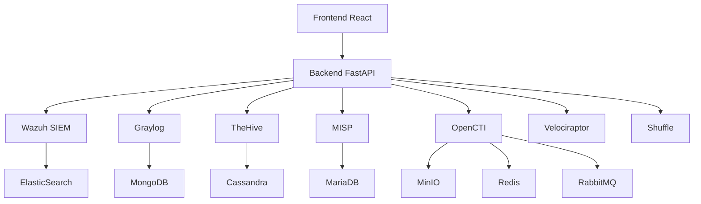

# CyberGuard Unified SOC - Architecture

Ce document détaille l'architecture technique du CyberGuard Unified SOC.

## Vue d'Ensemble

CyberGuard Unified SOC est une solution intégrée de sécurité qui combine plusieurs outils open source pour fournir une plateforme complète de Security Operations Center (SOC).

## Composants

### 1. Frontend
- Framework : React
- Features :
  - Interface utilisateur unifiée
  - Dashboards personnalisables
  - Visualisation des alertes
  - Gestion des cas
  - Administration système

### 2. Backend
- Framework : FastAPI
- Features :
  - API REST
  - Authentification centralisée
  - Intégration des services
  - Gestion des configurations
  - Automatisation des tâches

### 3. Services Intégrés

#### Wazuh
- SIEM (Security Information and Event Management)
- Détection des menaces
- Gestion des agents
- Analyse des logs

#### Graylog
- Centralisation des logs
- Analyse en temps réel
- Alerting
- Reporting

#### TheHive
- Gestion des cas
- Workflow d'investigation
- Collaboration
- Intégration Cortex

#### MISP
- Threat Intelligence Platform
- Partage d'IoCs
- Analyse des menaces
- Corrélation d'événements

#### OpenCTI
- Threat Intelligence
- Knowledge Base
- Visualisation des menaces
- Analyse des relations

#### Velociraptor
- Digital Forensics
- Response automatisée
- Collection de données
- Hunting

#### Shuffle
- Automatisation
- Orchestration
- Playbooks
- Intégrations

## Stockage

### Bases de Données

1. ElasticSearch
   - Usage : Wazuh, Logs
   - Type : NoSQL
   - Scalabilité : Horizontale

2. MongoDB
   - Usage : Graylog
   - Type : NoSQL
   - Scalabilité : Horizontale

3. Cassandra
   - Usage : TheHive
   - Type : NoSQL
   - Scalabilité : Horizontale

4. MariaDB
   - Usage : MISP
   - Type : SQL
   - Scalabilité : Verticale

5. MinIO
   - Usage : OpenCTI
   - Type : Object Storage
   - Scalabilité : Horizontale

### Cache

1. Redis
   - Usage : OpenCTI, Caching
   - Type : In-memory
   - Scalabilité : Cluster

### Message Queue

1. RabbitMQ
   - Usage : OpenCTI, Communications
   - Type : Message Broker
   - Scalabilité : Cluster

## Sécurité

### Authentication
- OAuth2/OpenID Connect
- MFA
- RBAC

### Communication
- TLS 1.3
- mTLS pour les services internes
- API Keys

### Données
- Chiffrement au repos
- Chiffrement en transit
- Backups chiffrés

## Déploiement

### Conteneurisation
- Docker
- Docker Compose
- Volumes persistants

### Réseau
- Réseaux Docker isolés
- Proxy inverse
- Firewalls

### High Availability
- Réplication des bases de données
- Load balancing
- Failover automatique

## Monitoring

### Métriques
- CPU
- Mémoire
- Stockage
- Réseau

### Health Checks
- Statut des services
- Latence
- Erreurs
- Saturations

### Alerting
- Notifications
- Escalades
- Intégrations

## Performance

### Optimisations
- Caching
- Indexation
- Compression

### Scalabilité
- Horizontale
- Verticale
- Auto-scaling

## Développement

### CI/CD
- Tests automatisés
- Intégration continue
- Déploiement continu

### Versioning
- Semantic versioning
- Git flow
- Release management

### Documentation
- API docs
- Guides utilisateurs
- Guides administrateurs
